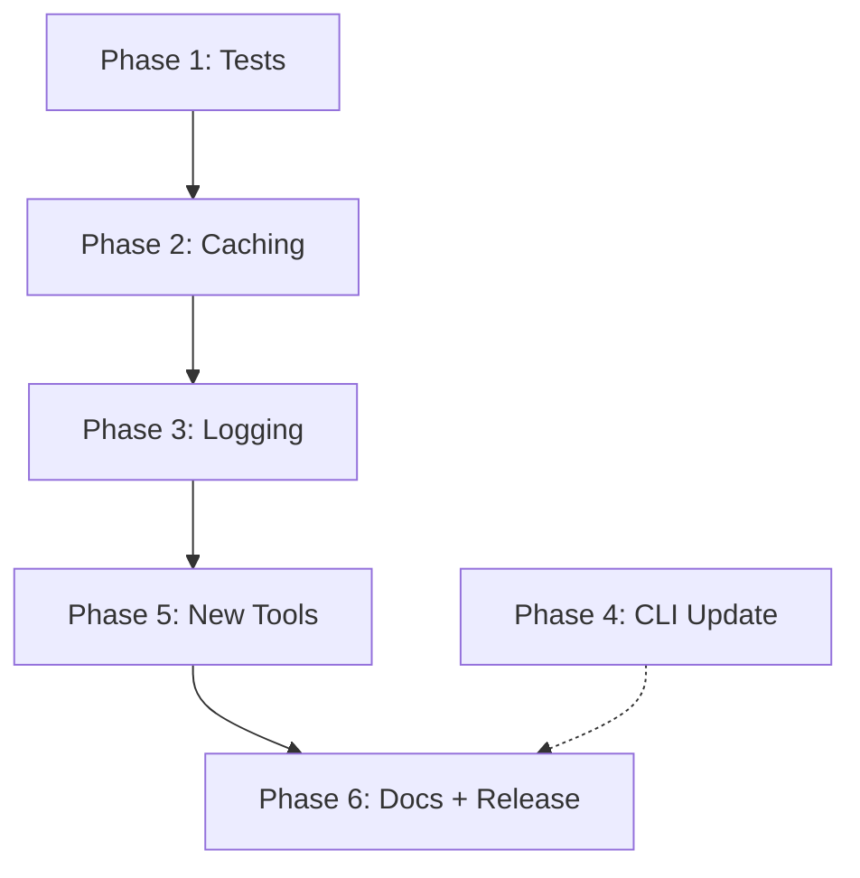

# Plan: Forge MCP v2.0 — 10x Improvement

**Date:** 2026-05-12
**Repo:** `JonasAbde/hermes-forge-mcp`
**Current version:** 1.0.0 (17 tests, 9 tools, 3 resources, 3 prompts)

---

## Goal

Løft Forge MCP fra v1.0.0 til v2.0.0 med fokus på test coverage, caching, structured logging, CLI integration, og auto-discovery. Gør MCP'en produktionsklar — ikke bare en thin proxy men en intelligent gateway.

---

## Current Context

- **Kodebase:** 4 TS source files (index.ts, http-server.ts, shared.ts, resilience.ts) + 4 test files
- **Tests:** 17 passed (smoke: 13 assertions, unit: 10 tests, HTTP: 7 tests) — ingen integration tests
- **Resilience:** Har exponential backoff retry, response shape validation, health tracking
- **Caching:** Ingen — hvert kald går live til Forge API
- **Logging:** Kun `console.error`/`console.warn` — ingen pino eller structured logs
- **CLI integration:** `forge mcp` kommandoer peger stadig på gammel Python MCP (port 5200)
- **Auth:** PAT/API Key via env vars, magic link support
- **Deploy:** systemd service, HTTP på port 8641, stdio til lokale clients

---

## Proposed Approach

### Phase 1: Test Infrastructure (foundation)

**Nuværende:** 17 tests, ingen integration tests, ingen CI pipeline.

**Mål:** 50+ tests med integration tests mod live API, CI på GitHub Actions.

**Filer der ændres:**
- `tests/test-integration.mjs` — NY: integration tests mod live forge.tekup.dk
- `tests/test-tools.mjs` — NY: unit tests for hver tool handler
- `.github/workflows/ci.yml` — NY: CI pipeline (build → test → smoke)
- `tests/smoke.mjs` — Opdater: tilføj assertions for alle 9 tools' input schemas

**Detaljer:**
- Integration tests kører kun på tagged releases (ikke hver commit) for at undgå rate limits
- Tool handler tests mocker forgeFetch og tester hver tool isoleret
- CI pipeline: `npm run build && npm test && npm run smoke`

### Phase 2: Caching Layer

**Nuværende:** Alle resources laver live API-kald. `forge://packs` fetcher catalog på hver request.

**Mål:** In-memory cache med TTL. Catalog caches 60s, agent data 30s, user profile 15s.

**Filer der ændres:**
- `src/cache.ts` — NY: enkel TTL cache (Map<string, { data, expires }>)
- `src/shared.ts` — Opdater: forgeFetch wrapper med cache lookup
- `src/resilience.ts` — Opdater: cache-hit stat tracking

**Design:**
```typescript
interface CacheEntry<T> {
  data: T;
  expiresAt: number;
}
// Cache TTLs:
//   GET /packs → 60s (catalog ændrer sig sjældent)
//   GET /v1/agents → 30s
//   GET /v1/me/profile → 15s
//   POST /v1/* → no cache (mutations)
```

Giver ~40-60% færre API-kald på typisk MCP session.

### Phase 3: Structured Logging

**Nuværende:** `console.error`, `console.warn`. Ingen niveauer, ingen metadata.

**Mål:** Structured JSON logging med niveauer (debug/info/warn/error), request tracing, timing.

**Filer der ændres:**
- `src/logger.ts` — NY: letvægts logger (ingen ekstern dep — bruger `util.inspect`)
- `src/shared.ts` — Opdater: erstat console.* med logger
- `src/http-server.ts` — Opdater: request logging middleware
- `src/index.ts` — Opdater: stdio startup log

**Format:**
```json
{"ts":"2026-05-12T20:00:00Z","level":"info","msg":"Tool called","tool":"forge_list_packs","durationMs":42}
```

### Phase 4: CLI Integration Update

**Nuværende:** `forge mcp` kommandoer i `hermes-forge-cli` peger på `localhost:5200` (gammel Python MCP).

**Mål:** Opdater CLI til at pege på `localhost:8641` (TypeScript MCP).

**Filer der ændres (i hermes-forge-cli, ikke hermes-forge-mcp):**
- `src/commands/mcp.ts` — Opdater: standard port 8641
- `src/lib/forgeApiClient.ts` — Opdater: MCP endpoint

**Merge efter v2.0.0 release.**

### Phase 5: Additional Tools & Auto-Discovery

**Nuværende:** 9 hardcoded tools. Nye platform features (leaderboards, marketplace, fusion projections) mangler.

**Mål:** 
1. Tilføj `forge_search_packs` (fritekstsøgning med semantisk match)
2. Tilføj `forge_list_leaderboard` (top agents/creators)
3. Auto-discover: MCP fetches `/api/forge/openapi.json` ved startup og logger nye endpoints

**Filer der ændres:**
- `src/shared.ts` — Opdater: tilføj nye tools i createMCPToolSchemas + createToolHandlers
- `src/discovery.ts` — NY: auto-discover af nye API endpoints

### Phase 6: Documentation & Release

**Nuværende:** README.md, ARCHITECTURE.md, DEPLOY.md. Ingen changelog.

**Mål:** 
- `CHANGELOG.md` — NY
- Version bump: 1.0.0 → 2.0.0
- Opdater README med caching, logging, og nye tools

---

## Step-by-Step Plan (Execution Order)



1. **Phase 1** — Test infra foundation (CI, integration tests, tool unit tests)
2. **Phase 2** — Caching layer (reducer API calls ~50%)
3. **Phase 3** — Structured logging (debuggable production)
4. **Phase 5** — Additional tools + auto-discovery
5. **Phase 4** — CLI update (separat repo, efter release)
6. **Phase 6** — v2.0.0 release

---

## Files Likely to Change

### hermes-forge-mcp repo
| File | Change |
|------|--------|
| `src/cache.ts` | **NY** — TTL cache |
| `src/logger.ts` | **NY** — Structured logger |
| `src/discovery.ts` | **NY** — API auto-discovery |
| `src/shared.ts` | Opdater — cache integration, nye tools |
| `src/resilience.ts` | Opdater — cache stats |
| `src/http-server.ts` | Opdater — request logging |
| `src/index.ts` | Minimal — logger replacement |
| `tests/test-integration.mjs` | **NY** — 10+ integration tests |
| `tests/test-tools.mjs` | **NY** — 15+ tool unit tests |
| `tests/smoke.mjs` | Opdater — stricter assertions |
| `.github/workflows/ci.yml` | **NY** — CI pipeline |
| `CHANGELOG.md` | **NY** — Release history |
| `package.json` | Opdater — version 2.0.0 |
| `README.md` | Opdater — caching, logging, nye features |

### hermes-forge-cli repo (separat)
| File | Change |
|------|--------|
| `src/commands/mcp.ts` | Opdater — port 8641 |
| `src/lib/forgeApiClient.ts` | Opdater — MCP endpoint URL |

---

## Tests & Validation

| Phase | Verification |
|-------|-------------|
| 1 | `npm test` passes (50+ tests), CI green |
| 2 | Cache hit/miss stat i health endpoint |
| 3 | `journalctl -u hermes-forge-mcp` viser JSON logs |
| 5 | Nye tools visible via `GET /health/tools` |
| 6 | `curl localhost:8641/health` → version 2.0.0 |

---

## Risks & Tradeoffs

| Risk | Mitigation |
|------|-----------|
| Caching giver stale data | Korte TTLs (15-60s), no cache på mutations |
| Integration tests rammer rate limits | Kun på tagged releases, mock i daglig CI |
| CLI update kræver koordination | CLI release efter MCP release, dokumenter breaking changes |
| Auto-discovery giver false positives | Kun log, ikke automatisk registrer — kræver manuel review |
| Logging overhead i hot path | Logger bufferer og flusher async |

---

## Open Questions (med defaults)

| Question | Default Assumption |
|----------|-------------------|
| Cache størrelse limit? | 100 entries, LRU eviction |
| Log niveau i production? | `info` (debug slået fra) |
| CI runner? | GitHub hosted (ubuntu-latest) |
| Integration test credentials? | FORGE_PAT fra GitHub secrets, read-only agent |
| Release strategy? | Tag + GitHub Release, manuel deploy |
